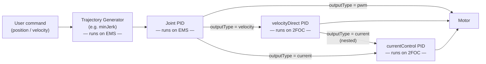
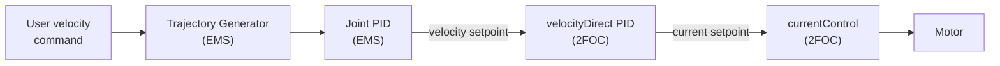

# Configuration Guide: the `CONTROLS` Group

This document explains how to configure the `CONTROLS` group in the motor control XML files
(e.g. `cer_base-ems1-mc.xml`). It is intended for robot integrators and configurators who may
not have a deep background in control theory.
If you want more details please see [this comment]([url](https://github.com/mesh-iit/sw-management/issues/248#issuecomment-5528353317)) with the complete description.  

## Index

- [Overview](#overview)
- [Control modes: what each parameter means](#control-modes-what-each-parameter-means)
- [The trajectory-generator modes: position, velocity, mixed](#the-trajectory-generator-modes-position-velocity-mixed)
  - [Available trajectory generator](#available-trajectory-generator)
  - [The `outputType` parameter: what does the PID drive?](#the-outputtype-parameter-what-does-the-pid-drive)
- [A note on `velocityControl`](#a-note-on-velocitycontrol)
- [`velocityDirect` and `positionDirect`: no trajectory generator](#velocitydirect-and-positiondirect-no-trajectory-generator)
- [Where the PID runs: EMS vs. 2FOC](#where-the-pid-runs-ems-vs-2foc)
- [Nested current loop inside velocity direct](#nested-current-loop-inside-velocity-direct)
- [Worked example: `cer_base-ems1-mc.xml`](#worked-example-cer_base-ems1-mcxml)
- [Quick reference: `controlLaw` values](#quick-reference-controllaw-values)

---


---

## Overview

The `CONTROLS` group is a **routing table**: for each control mode that YARP exposes to the user,
it assigns the name of the PID group that implements it. Each name either points to a `<group>`
defined later in the same file, or is set to `NONE` to disable that mode.

```xml
<group name="CONTROLS">
    <param name="positionControl">   JOINT_MINJERK_OUT_VEL_CTRL    JOINT_MINJERK_OUT_VEL_CTRL  </param>
    <param name="velocityControl">   JOINT_MINJERK_OUT_VEL_CTRL    JOINT_MINJERK_OUT_VEL_CTRL  </param>
    <param name="mixedControl">      JOINT_MINJERK_OUT_VEL_CTRL    JOINT_MINJERK_OUT_VEL_CTRL  </param>
    <param name="torqueControl">     NONE                          NONE                        </param>
    <param name="currentControl">    CURRENT_CONTROL               CURRENT_CONTROL             </param>
    <param name="positionDirect">    NONE                          NONE                        </param>
    <param name="velocityDirect">    JOINT_VEL_DIRECT_OUT_PWM_CTRL JOINT_VEL_DIRECT_OUT_PWM_CTRL </param>
</group>
```

One value per joint is listed on each line (two joints in the example above).

---

## Control modes: what each parameter means

| Parameter | YARP interface | Description |
|---|---|---|
| `positionControl` | `IPositionControl` | Move a joint to a target angle using a trajectory generator |
| `velocityControl` | `IVelocityControl` | Command a joint velocity through a trajectory generator (see note below) |
| `mixedControl` | - | Combination of position and velocity target |
| `torqueControl` | `ITorqueControl` | Direct torque command |
| `currentControl` | `ICurrentControl` | Inner current PID running on the 2FOC board |
| `positionDirect` | `IPositionDirect` | Direct position command, **no** trajectory generator |
| `velocityDirect` | `IVelocityControl` direct | Direct motor velocity command, **no** trajectory generator |

> **`NONE`** means the mode is disabled. Trying to switch to a disabled mode at runtime will fail.

---

## The trajectory-generator modes: position, velocity, mixed

`positionControl`, `velocityControl`, and `mixedControl` all share the same structure: a
**trajectory generator** smooths the user command before it reaches the PID. This avoids
sudden jerks when a new setpoint is sent.

### Available trajectory generator

Currently only one trajectory law is supported:

| `controlLaw` value | Description |
|---|---|
| `minjerk` | Minimum-jerk profile — produces the smoothest possible motion for a given duration |

### The `outputType` parameter: what does the PID drive?

Once the trajectory generator has computed the next setpoint, the PID calculates a correction
signal. The `outputType` parameter tells the system **what physical quantity that signal
represents**, and therefore which inner loop it feeds.

| `outputType` | The joint PID output is... | What happens next |
|---|---|---|
| `pwm` | A PWM duty-cycle command | Sent **directly** to the motor driver — no inner loop |
| `velocity` | A motor velocity setpoint | Fed into the **velocityDirect** PID (runs on the 2FOC) |
| `current` | A motor current setpoint | Fed into the **currentControl** loop (runs on the 2FOC) |

The cascade structure can be visualised as follows:



---

## A note on `velocityControl`

Despite its name, **`velocityControl` is NOT a direct velocity controller**. For historical
(legacy) reasons it works as follows:

1. The user sends a velocity command $\dot{q}_{ref}$.
2. The firmware **integrates** it over time to obtain a position target $q_{ref}$.
3. That position target is passed to the **same trajectory generator and PID** used for
   `positionControl`.

In other words, `velocityControl` and `positionControl` typically reference the **same PID
group**. The distinction is only in how the setpoint is generated on the software side.

If you want to command the motor velocity directly (without a trajectory generator), use
`velocityDirect` instead.

---

## `velocityDirect` and `positionDirect`: no trajectory generator

These two modes bypass the trajectory generator entirely. The user command goes **straight into
the PID**. The `controlLaw` value `direct` signals exactly this: no intermediate smoothing,
the PID sees the raw user input. Note that `velocityDirect` executes on the **2FOC** (using
machine units), while `positionDirect` executes on the **EMS** (using metric units).

---

## Where the PID runs: EMS vs. 2FOC

For robots where joints are driven by the **EMS + 2FOC** board pair, it is important to
understand the hardware split:

| Loop | Runs on | Unit system |
|---|---|---|
| Trajectory generator + joint PID (`positionControl`, `velocityControl`, `mixedControl`) | **EMS** | **Metric units** (degrees, degrees/s, …) |
| `velocityDirect` PID | **2FOC** | **Machine units** (raw encoder ticks, raw DAC counts, …) |
| `currentControl` loop | **2FOC** | **Machine units** |

This is the reason why the PID gains for `velocityDirect` and `currentControl` look very different
from those of the joint PID: they operate on completely different numerical scales.

The `fbkControlUnits` and `outputControlUnits` parameters in each PID group reflect this:

| Value | Meaning |
|---|---|
| `machine_units` | Raw hardware units — used for 2FOC loops |
| `metric_units` | Physical units (degrees, degrees/s, …) — used for EMS loops |
| `dutycycle_percent` | PWM duty cycle expressed as a percentage |

---

## Nested current loop inside velocity direct

It is possible to cascade the current loop inside the velocity direct loop by setting
`outputType = current` in the `velocityDirect` PID group. The signal flow then becomes:



---

## Worked example: `cer_base-ems1-mc.xml`

```xml
<group name="CONTROLS">
    <param name="positionControl">  JOINT_MINJERK_OUT_VEL_CTRL   ...  </param>
    <param name="velocityControl">  JOINT_MINJERK_OUT_VEL_CTRL   ...  </param>
    <param name="velocityDirect">   JOINT_VEL_DIRECT_OUT_PWM_CTRL ... </param>
    <param name="currentControl">       CURRENT_CONTROL              ...  </param>
    <param name="torqueControl">    NONE                         ...  </param>
    <param name="positionDirect">   NONE                         ...  </param>
</group>
```

| Mode | PID group | `controlLaw` | `outputType` | Runs on |
|---|---|---|---|---|
| `positionControl` | `JOINT_MINJERK_OUT_VEL_CTRL` | `minjerk` | `velocity` | EMS → 2FOC |
| `velocityControl` | `JOINT_MINJERK_OUT_VEL_CTRL` | `minjerk` | `velocity` | EMS → 2FOC |
| `velocityDirect` | `JOINT_VEL_DIRECT_OUT_PWM_CTRL` | `direct` | `pwm` | 2FOC only |
| `currentControl` | `CURRENT_CONTROL` | `low_lev_current` | *(n/a)* | 2FOC only |
| `torqueControl` | *(disabled)* | — | — | — |
| `positionDirect` | *(disabled)* | — | — | — |

The full cascade for position/velocity commands on this robot is therefore:

```
User command → minJerk trajectory (EMS) → joint PID (EMS) → velocity setpoint
             → velocityDirect PID (2FOC) → PWM → Motor
```

---

## Quick reference: `controlLaw` values

| `controlLaw` | Used in | Trajectory generator? | Notes |
|---|---|---|---|
| `minjerk` | `positionControl`, `velocityControl`, `mixedControl` | **Yes** | Only option currently available |
| `direct` | `positionDirect`, `velocityDirect` | **No** | Input goes straight to the PID |
| `torque` | `torqueControl` | No | Torque regulation |
| `low_lev_current` | `currentControl` | No | Inner current loop on 2FOC |
